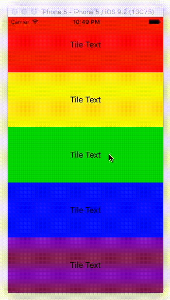

# NTKit

NTKit is a collection of custom UI elements built in Swift 2.  These elements are designed as a starting place for other applications.

# Contents

**Demo App:** All of the objects listed below are used in some way in the NTKitDemo app included in this project.  The demo app should also show a base implementation.

## NTTileView

The NTTileView is designed as a quick way to add a set of expanding tiles to your app.  To get started:

1. Add a NTTileView to your app.
2. Set the DataSource and implement the DataSource methods
3. Enjoy

## NTImageView

NTImageView is a custom view designed to display an image and let the user zoom in and out.  To use:

1. Add a new UIView of type NTImageView
2. Set the image attribute (`[your view].image`)
3. Enjoy

To customize the default minimum and maximum zoom amounts, set the `defaultMinimumZoomScale` and `defaultMaximumZoomScale` values.

# License

This project is completely open source and under the MIT license. For full details please see [license.md](LICENSE.md)